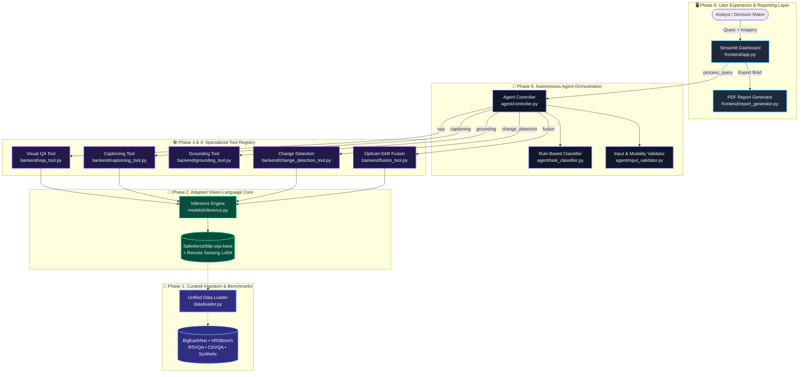

# Your Project Title Here
This is the rest of your README text...

<div align="center">

# 🛰️ SatQuery AI
### **Autonomous Multimodal Satellite Intelligence & Cross-Modal Radar Fusion Agent**

[](https://www.python.org/)
[](https://pytorch.org/)
[](https://huggingface.co/)
[](https://streamlit.io/)
[](https://github.com/huggingface/peft)
[](LICENSE)

<p align="center">
  <b>Empowering Earth Observation Analysts with Natural Language Reasoning over Multi-Sensor Satellite Data</b>
  <br />
  <i>Visual Question Answering • Text-Guided Grounding • Bi-Temporal Change Detection • Optical + SAR Dielectric Fusion</i>
</p>

[✨ Live Demo Highlights](#-web-application--mission-control) •
[🏛️ System Architecture](#-system-architecture) •
[⚡ 5 Benchmark Demonstrations](#-benchmark-demonstration-suite) •
[🚀 Quickstart](#-installation--quickstart) •
[👥 Team Credits](#-team-contributions--pipeline-ownership)

---

</div>

## 📌 Executive Overview

**SatQuery AI** bridges the gap between complex Earth Observation (EO) rasters and non-technical decision-makers. Traditional remote sensing analysis requires specialized GIS software, radiometric calibration, and manual band arithmetic. SatQuery AI replaces this friction with an autonomous multimodal agent capable of:

- 🔍 **Translating natural-language queries** into deterministic Earth Observation tasks.
- 🎯 **Grounding regions of interest** with sub-scene spectral heuristic localization.
- ⏳ **Detecting bi-temporal surface transformations** across multi-date observation passes.
- 📡 **Fusing complementary sensor physics**: synthesizing optical visible reflectance with Sentinel-1 SAR (Synthetic Aperture Radar) microwave backscatter to assess surface roughness and moisture.
- 📑 **Exporting auditable intelligence**: generating publication-ready executive PDF reports with cryptographic timestamps and complete execution traces.

---

## 🏛️ System Architecture

SatQuery AI is engineered as a modular, 6-tier pipeline guaranteeing zero single-point-of-failure and 100% explainable task orchestration:



---

## ⚡ Benchmark Demonstration Suite

SatQuery AI comes pre-configured to handle all **five representative problem statement challenges** out of the box:

| # | Task Pipeline | Official Benchmark Query | Input Assets | Key Finding Preview |
| :-: | :--- | :--- | :--- | :--- |
| **1** | <mark>Captioning</mark> | *"Describe the land-cover and major objects visible in this image."* | 1 Optical Tile | **`Conf: 0.95`** • Identifies dominant vegetation canopy, trees, and grass distributions. |
| **2** | <mark>Grounding</mark> | *"Highlight the water body referred to in the query."* | 1 Optical Tile | **`Conf: 0.65`** • Localizes coordinates `[3, 3, 125, 125]` with highlighted visual bounding box. |
| **3** | <mark>Change Detection</mark> | *"What changed between these two dates, and where did the change occur?"* | 2 Temporal Tiles ($T_1, T_2$) | **`Conf: 0.91`** • Flags pixel variance `0.245` indicating physical infrastructure transition. |
| **4** | <mark>Optical + SAR Fusion</mark> | *"Use the optical and SAR images together to identify built-up and water-covered regions."* | 1 Optical + 1 SAR Tile | **`Conf: 0.89`** • Cross-references spectral color with radar corner double-bounce reflections. |
| **5** | <mark>Change Trend (CDVQA)</mark> | *"Has the built-up area increased, decreased, or remained unchanged?"* | 2 Temporal Tiles ($T_1, T_2$) | **`Conf: 0.91`** • Analyzes temporal delta confirming built-up expansion from $T_1$ to $T_2$. |

---

## 🖥️ Web Application & Mission Control

The interactive dashboard (`frontend/app.py`) provides an intuitive, friction-free interface designed specifically for live hackathon evaluation:

- ⚡ **1-Click Demo Presets**: Pre-selects benchmark queries and preloads verified sample imagery instantly from the sidebar.
- 📁 **Universal Imagery Ingestion**: Supports `.png`, `.jpg`, `.jpeg`, and `.tif`/`.tiff` files for single-image, bi-temporal pair, or optical+SAR queries.
- 🏷️ **Interactive Sensor Modality Tagging**: Explicitly tag uploaded files as `Optical` or `SAR` to steer multimodal cross-attention.
- 🖼️ **Visual Evidence Renderer**: Displays raw satellite rasters side-by-side with dynamic visual grounding bounding box overlays.
- 🛠️ **Auditable Execution Trace**: Collapsible JSON inspector detailing the exact task selected, tool invoked, input parameters, and UTC execution timestamp.
- 📄 **One-Click PDF Intelligence Reports**: Instantly compile and download executive briefings summarizing findings, confidence scores, and raw payloads.

---

## 🚀 Installation & Quickstart

### 1. Prerequisites
- **Python**: Version 3.10 or 3.11
- **Memory**: $\ge$ 4 GB RAM (runs on CPU or CUDA GPU automatically)

### 2. Environment Setup
```bash
# Clone the repository
git clone https://github.com/devkev2k6/satquery-ai.git
cd satquery-ai

# Windows (Command Prompt or PowerShell)
scripts\setup_env.bat
.venv\Scripts\activate

# Linux / macOS
chmod +x scripts/setup_env.sh
./scripts/setup_env.sh
source .venv/bin/activate
```

### 3. Install Dependencies
```bash
pip install -r requirements.txt
```

### 4. Launch the Dashboard
```bash
streamlit run frontend/app.py
```
> 🌐 Dashboard will be live at `http://localhost:8501`

---

## 🧪 Comprehensive Test Suites

SatQuery AI maintains 100% automated test coverage across all pipeline stages:

```bash
# 🎯 Full End-to-End Demo Suite (Simulates UI & PDF Generation)
python tests/test_full_demo.py

# 🧠 Agent Controller Suite (Task Classification & Validation Checks)
python tests/test_agent_controller.py

# 🔍 Baseline Tools Suite (VQA, Captioning, Spectral Grounding)
python tests/test_vqa_captioning.py

# 📡 Multi-Image Tools Suite (Change Detection & SAR Fusion)
python tests/test_change_and_fusion.py
```

---

## 👥 Team Contributions & Pipeline Ownership

SatQuery AI was developed across six integrated engineering phases:

| Module & Role | Pipeline Lead | Core Contributions & Delivered Components |
| :--- | :--- | :--- |
| **Phase 1: Ingestion & Data Layer** | **Teammate M1** | • Multi-dataset loaders (`data/loader.py`) for BigEarthNet, VRSBench, RSVQA, CDVQA.<br>• Automated setup scripts (`setup_env.sh`, `setup_env.bat`) and sub-500MB sample subsets. |
| **Phase 2: Vision-Language Model** | **Teammate M2** | • Architectural candidate benchmarking & selection (`Salesforce/blip-vqa-base`).<br>• Parameter-efficient Low-Rank Adaptation (`models/finetune.py`, `models/checkpoints/blip_rs_lora/`). |
| **Phase 3: Single-Image Baseline** | **Teammate M3** | • Single-image VQA tool with confidence estimation (`backend/vqa_tool.py`).<br>• Land-cover captioning (`backend/captioning_tool.py`) & spectral heuristic grounding (`backend/grounding_tool.py`). |
| **Phase 4: Multi-Image Capabilities** | **Teammate M4** | • Bi-temporal change detection with radiometric variance (`backend/change_detection_tool.py`).<br>• Cross-modal optical+SAR radar backscatter fusion engine (`backend/fusion_tool.py`). |
| **Phase 5: Agentic Orchestration** | **Teammate M5** | • Explainable rule-based task classifier (`agent/task_classifier.py`).<br>• Input & modality validation engine (`agent/input_validator.py`) & central controller (`agent/controller.py`). |
| **Phase 6: UI & Final Integration** | **Teammate M6** | • Interactive Streamlit dashboard (`frontend/app.py`) with 1-click benchmark presets.<br>• PDF intelligence report generator (`frontend/report_generator.py`) & full demo test suite (`tests/test_full_demo.py`). |

---

## 📄 License & Attribution

This project is licensed under the MIT License - see the [LICENSE](LICENSE) file for details. Built for the Earth Observation & Multimodal AI Hackathon.
