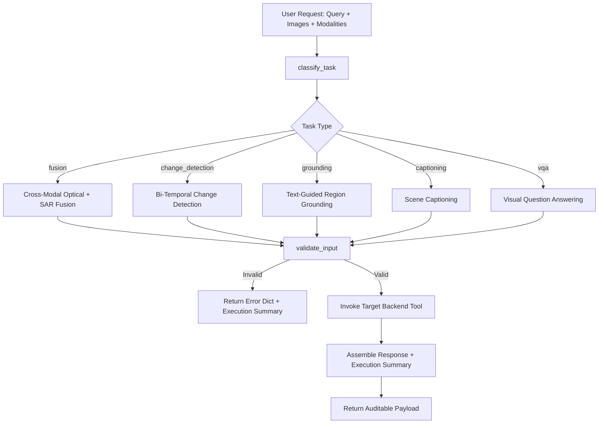

# SatQuery AI - Agentic Model & Tool Orchestration

The `agent/` module is the central intelligence layer ("the brain") of **SatQuery AI**. It interprets natural language user queries, inspects accompanying satellite imagery and sensor modalities, validates inputs, dynamically routes to specialized backend tools, and packages the results alongside a transparent, auditable execution record.

---

## 1. Architecture Overview

The agent controller fulfills the core problem statement criteria for **Agentic Model and Tool Orchestration**:
- **Query & Context Interpretation**: Dissects input queries for semantic intent and inspects image metadata (count, file format, sensor modality).
- **Rule-Based Deterministic Task Routing**: Directs queries to one of five pipelines (`vqa`, `captioning`, `grounding`, `change_detection`, `fusion`).
- **Input Validation & Safety**: Rejects invalid requests (e.g., single-image change detection, invalid image formats, non-existent files, modality mismatches) with clear diagnostic errors before executing heavy neural tools.
- **Auditable Execution Summary**: Every response includes an audit log detailing the selected task, the backend tool invoked, key dispatched parameters, and a UTC timestamp.



---

## 2. Directory Structure

```text
agent/
├── controller.py         # Main orchestrator entry point (process_query)
├── task_classifier.py    # Deterministic rule-based task routing engine (classify_task)
├── input_validator.py    # Schema, file format, modality, and image count verification
└── README.md             # This architecture and developer guide
```

---

## 3. Task Classification Logic & Rules (`classify_task`)

Task routing is implemented in `agent/task_classifier.py` using a transparent, rule-based hierarchy. This ensures explainability and predictable behavior under competition evaluation.

### Decision Precedence & Trigger Rules

| Priority | Task Label | Modality / Image Count Condition | Keyword Triggers in User Query | Backend Tool Invoked |
| :---: | :--- | :--- | :--- | :--- |
| **1** | **`fusion`** | `num_images == 2` AND modalities include both Optical and SAR (`"optical"`, `"sar"`/`"radar"`). | `"optical and sar"`, `"sar and optical"`, `"sensor fusion"`, `"cross-modal"`, `"fuse optical"`, `"both optical and sar"`. | `backend.fusion_tool.run_optical_sar_fusion` |
| **2** | **`change_detection`** | `num_images == 2` (non-fusion) OR query indicates temporal comparison. | `"changed"`, `"change"`, `"between these two"`, `"before and after"`, `"increased, decreased, or remained unchanged"`, `"difference between"`, `"deforestation"`, `"temporal"`, `"time 1"`, `"time 2"`. | `backend.change_detection_tool.run_change_detection` |
| **3** | **`grounding`** | `num_images == 1` | `"highlight"`, `"where is"`, `"where are"`, `"locate"`, `"localize"`, `"bounding box"`, `"bbox"`, `"coordinates"`, `"pinpoint"`. | `backend.grounding_tool.run_grounding` |
| **4** | **`captioning`** | `num_images == 1` (with descriptive prompt or empty query) | Query is empty/None OR contains `"describe"`, `"caption"`, `"overview"`, `"summarize"`, `"what does this image show"`, `"land-cover and major objects"`. | `backend.captioning_tool.run_captioning` |
| **5** | **`vqa`** | `num_images == 1` (default fallback for single-image queries) | Interrogative questions (`"what"`, `"is there"`, `"how many"`, `"which"`, `"?"`) or general queries. | `backend.vqa_tool.run_vqa` |

---

## 4. Input Validation Contracts (`validate_input`)

The input validator (`agent/input_validator.py`) inspects requests before any model execution:

1. **Image Count Verification**:
   - `change_detection` requires exactly 2 images ($T_1$ and $T_2$).
   - `fusion` requires exactly 2 images (Optical and SAR).
   - `captioning`, `grounding`, `vqa` require exactly 1 image.
2. **File Existence & Format**:
   - Confirms files physically exist on disk (resolving relative paths against the project root).
   - Validates file extensions against supported formats: `.png`, `.jpg`, `.jpeg`, `.tif`, `.tiff`.
3. **Modality Verification**:
   - For `fusion`: validates that one image is Optical (`"optical"`, `"rgb"`, `"multispectral"`) and one image is SAR (`"sar"`, `"radar"`, `"sentinel-1"`).
4. **Query Presence**:
   - Tasks requiring specific queries (`vqa`, `grounding`) must have a non-empty query string.

---

## 5. Main Orchestration API (`process_query`)

External callers (such as the M6 Streamlit frontend) interact with the agent through a single top-level function:

```python
from agent.controller import process_query

response = process_query(
    query="Describe the land-cover and major objects visible in this image.",
    image_paths=["data/sample/optical/sample_optical_001.png"],
    image_types=["optical"]  # Optional: defaults/infers if omitted
)
```

### Response Schema

```json
{
  "result": {
    "task": "captioning",
    "caption": "Satellite imagery showing flat land.",
    "confidence": 0.88,
    "image_path": "data/sample/optical/sample_optical_001.png"
  },
  "execution_summary": {
    "task": "captioning",
    "tool_used": "run_captioning",
    "parameters": {
      "image_path": "data/sample/optical/sample_optical_001.png",
      "prompt": "Describe the land-cover and major objects visible in this image."
    },
    "timestamp": "2026-09-10T07:15:30.123456+00:00"
  },
  "success": true
}
```

If validation fails, `success` is `false`, and `result.error` explains the rejection reason while still returning an auditable `execution_summary`.

---

## 6. How to Extend With a New Task Type

Adding a new task (e.g., `segmentation` or `object_counting`) is straightforward:

1. **Add Backend Tool**:
   - Implement the tool under `backend/segmentation_tool.py` exposing `run_segmentation(image_path: str, target: str) -> dict`.
2. **Update `agent/task_classifier.py`**:
   - Add new trigger keywords (e.g. `"segment"`, `"mask"`, `"outline"`, `"contour"`).
   - Add condition to return `"segmentation"`.
3. **Update `agent/input_validator.py`**:
   - Add constraints for the new task (e.g., single-image requirement).
4. **Update `agent/controller.py`**:
   - Import the tool function.
   - Add `elif task == "segmentation":` branch in `process_query()`.
5. **Add Verification Test**:
   - Add test case in `tests/test_agent_controller.py`.
